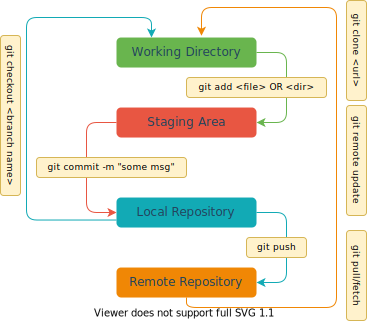

# Git Ops CheatSheet

* [Basic Operations](#basic-ops)
  * [Git Config](#gitconfig)
  * [Git Ops Flow](#gitopsflow)
  * [Git Clone](#gitclone)
  * [Git Initialize](#gitinit)
  * [Git Status](#gitstatus)
  * [Git Add](#gitadd)
  * [Git Commit](#gitcommit)
  * [Git Log](#gitlog)
  * [Git Pull](#gitpull)
  * [Git Push](#girpush)
* [Branch Operations](#branch-ops)
* [Update Branch Operations](#update-ops)
* [Clean-Up Operations](#clean-ops)
* [Tag Operations](#tag-ops)
* [Undo Operations](#undo-ops)
  * [Git Revert](#gitrevert)
  * [Git Reset](#gitreset)
  * [Git Clean](#gitclean)
  * [Git Reflog](#gitreflog)
 

### <a name="basic-ops"></a> Basic Operations
##### <a name="gitconfig"></a> Git Config
  > **Set Git configuration values on a global or local project level these configuration levels correspond to .gitconfig text files.**
  >
  > This is a very important part of setting up a repo, since here is where you set up author name, email.
  >
  > Executing git config will modify a configuration text file.
  >
  > Copy to ```~/.gitconfig``` home and modify this reference file [Git Config File].
  >
  > **Git Config, change name, email. Globally or Locally**
  >
  > The global flag will modify ```~/.gitconfig``` which applies if no local config is overriding it.The local flag will modify ```.git/config```.
  > > local changes: ```git config --local user.name <name>```
  > > 
  > > global changes: ```git config --global user.name <name>```
  > > 
  > > local changes: ```git config --local user.email <email>```
  > > 
  > > global changes: ```git config --global user.email <email>```
  >
  > Set text editor used by commands for all users on the machine. <editor> arg should be the command that launches the desired editor (e.g., vi).
  > > ```git config --system core.editor <editor>```
  >
  > Open the global configuration file in a text editor for manual editing.
  > > ```git config --global --edit```
##### <a name="gitopsflow"></a> Git Ops Flow
  > **Basic Understanding**
  >
  > 
##### <a name="gitclone"></a> Git Clone
  > Clone the entire remote repository
  >
  > ```git clone <url> <directory name>```
  >
  > Clone a single branch
  >
  > ```git clone <url> --branch <branch name>```
##### <a name="gitinit"></a> Git Initialize
  > Create an empty directory and ```cd``` to it
  > > ```mkdir <directory name>; cd <directory name>```
  >
  > Initial a git repository
  > > ```git init```
  >
  > Add some files for initial commit, ```README.md```
  > > ```git add README.md```
  > >
  > > ```git commit -m "Initial Commit"```
  >
  > Add a remote url then push the code to remote repository
  > ```git remote add origin <url>```
  >
  > ```git push -u origin master```
##### <a name="gitstatus"></a> Git Status
  > List which files are staged, unstaged, and untracked.
  > 
  > List the current state of the branch you're on.
  > >```git status```
  > 
  > Short output: ```git status -s```
##### <a name="gitadd"></a> Git Add
  > Stage all changes in <directory> for the next commit. Replace <directory> with a <file> to change a specific file.
  > > ```git add <directory>``` OR ```git add  <file>```
  > 
  > Add all untracked files from working directory to staging area
  > > ```git add .```
##### <a name="gitcommit"></a> Git Commit
  > Commit the staged snapshot, but instead of launching a text editor, use <message> as the commit message.
  > > ```git commit -m "<message>"```
  > 
  > Edit the last commit by amending it, this will add missing 
  >
  > This requires a ```git push --force``` after, to be able to rewrite the last commit.
  > > ```git commit --amend```
  >
  > Add a granular commit
  > >```git add -p```
##### <a name="gitlog"></a> Git Log
  > Display the entire commit history using default format: ```git log```
  >
  > Limit log with details : ```git log -<limit>```, example:```git log -5```
  >
  > Show last 10 commit collapsed in one line per commit: ```git log -10 --oneline```
  >
  > Display the full diff of each commit.
  > > ```git log -p```
  > 
  > Search for commits by a particular author.
  > > ```git log --author="<pattern>"```
  > 
  > Search for commits with a commit message that matches <pattern>.
  > > ```git log --grep="<pattern>"```
  > 
  > Only display commits that have the specified file.
  > > ```git log -- <file>```
  > 
  > Show commits that occur between <since> and <until>. Args can be a commit ID, branch name, HEAD, or any other kind of revision reference.
  > > ```git log <since>..<until>```
  > 
  > --graph flag draws a text based graph of commits on left side of commit msgs. --decorate adds names of branches or tags of commits shown.
  > > ```git log --graph --decorate```
##### <a name="gitpull"></a> Git Pull
  > Fetch the specified remote's copy of current branch and immediately **merge** it into the local copy.
  > > ```git pull <remote>``` OR ```git pull```
  >
  > Interactively rebase current branch onto <base>.
  >
  > Launches editor to enter commands for how each commit will be transferred to the new base.
  > base can be a commit ID, branch name, a tag, or a relative reference to HEAD.
  >
  > > ```git rebase -i <base>```
##### <a name="gitpush"></a> Git Push
  > Push the current branch to <remote>, along with necessary commits and objects. 
  >
  > Creates named branch in the remote repo if it doesn't exist.
  > > ```git push <remote> <branch>``` OR ```git push```
  >
  > Forces the git push even if it results in a non-fast-forward merge.
  >
  > Do not use the --force flag unless you’re absolutely sure you know what you’re doing.
  > > ```git push <remote> --force``` OR ```git push --force```
  > 
  > Push all of your local branches to the specified remote.
  > > ```git push <remote> --all```
### <a name="branch-ops"></a> Branch Operations
##### Update all local branches from remote
  > ```git remote update```
##### List all branches in the current repository
  > ```git branch -a```
##### Checkout to another branch (move from one branch to another)
  > ```git checkout <branch name>```
##### Create local branch and set up to track remote branch from origin
  > ```git checkout -b <branch name> origin/<branch name>```
##### Update current branch
  > ```git fetch```
##### Update just the current local branch from 
  > ```git fetch origin <branch name>```
##### Rename a branch
  > ```git checkout <branch name>```
  >
  > ```git branch -m <new branch name>```
##### Rename branch while pointing to another branch
  > ```git branch -m <old branch> <new branch>```
  >
  > ```git push origin <new branch>```
  >
  > ```git push origin --delete <old branch>```
##### Rename branch while pointing to another branch, one command
  > ```git push origin :<oldbranch> <new branch>```
##### Delete local branch
  > checkout to another branch, you cannot delete while on the same branch
  >
  > ```git branch -D <branch name>```
##### Delete remote branch
  > ```git push origin --delete <branch name>```
##### If upstream branch is renamed or gone:
  > ```git branch --unset-upstream```
  >
  > ```git push --set-upstream origin <new name> OR <new branch>```
##### Checkout the branch where you want to create the tag
  > ```git checkout <branch name>```
  > > example: ```git checkout master```
  > >
  > > example: ```git checkout feature/JIRA-ID-some-task-name_GD```

### <a name="clean-ops"></a> Clean-Up Operations
  > A clean-up operation is basically a preparation before PR (Peer Request)
  >
  > Let's say I want to PR my ```feature``` branch into upstream ```develop```
  >
  > In this case ```develop``` is my destination branch, and ```feature``` is my current branch
  >
  > This means I have 6 branches in total:
  > > ```feature``` branch, ```origin/feature``` branch and my upstream ```feature``` branch
  > > 
  > > ```develop``` branch, ```origin/develop``` branch and my upstream ```develop``` branch
  >
  > There are a few steps for clean-up:
  > > 1. Fetch from upstream ```develop``` branch, this will update the ```origin/develop``` local branches from upstream.
  > > > ```git fetch --all```
  > > >
  > > > Now our upstream ```develop``` branch is updated with our ```origin/develop``` branch, but did not touch our local ```develop``` branch.
  > >
  > > 2. Rebase ```origin/develop``` branch into current ```feature``` branch.
  > > > ```git rebase origin/develop```
  > > >
  > > > Resolve conflicts if any.
  > > 3. Now since we have all updates from upstream develop branch we can squash our commits to reduce noise.
  > > > Get the latest ancestor with ```develop``` branch
  > > > 
  > > > ```git log --oneline```
  > > > 
  > > > It should look smth like this:
  > > > 
  > > > ```ec5dc35 (HEAD -> feature, origin/feature) commit 3```
  > > >
  > > > ```45bf869 commit 2```
  > > >
  > > > ```7c8362c commit 1```
  > > >
  > > > ```75556a7 (develop, origin/develop) Some Merge from another feature```
  > > >
  > > > ```75556a7``` is our feature branch ancestor with develop
  > > 4. Squash your commits with a meaningful, logical commit message on lines
  > > > ```Feature:``` or ```bugfix:``` or ```hotfix:```
  > > > ```some meaningful starting from 2nd line```
  > > > ```git rebase --interactive --autosquash 75556a7```
  > > >
  > > > Selected one commit to use and the rest to squash, maybe some to drop, and you show have something like this:
  > > > 
  > > > ```bc9bc42 (HEAD -> feature, origin/feature) Feature: some meaningful starting from 2nd line```
  > > > 
  > > > ```75556a7 (develop, origin/develop) Some Merge from another feature```
  > > 5. Now push your feature branch to upstream
  > > > ```git push --force```
  > > 6. Now you can go ahead PR
### <a name="tag-ops"></a> Tag Operations
##### Create tag with some name
  > ```git tag <tag name>```
  > 
  > > example: ```git tag 1.0.0```
##### Create annotated tag
  > ```git tag -a 1.0.0 -m "some tag description"```
##### Display or Show tags
  > ```git tag```
  >
  > ```git show 1.0.0```
  >
  > ```git tag -l "1.*"```
  >
  > ```git rev-list --tags```
  >
  > ```git rev-list --tags --date-order``` 
##### Push tags to remote
  > ```git push origin 1.0.0```
##### Push all tags at once
  > ```git push origin --tags```
  >
  > ```git push --tags```
##### Push tags to other branches
  > ```git checkout -b stable/1.0.0 1.0.0```
##### Delete tags from local <font color='red'>(!!! USE ONLY IN EXTREME CASES !!!)</font>
  > ```git tag -d 1.0.0```
  >
  > ```git tag --delete 1.0.0```
##### Delete tags from remote <font color='red'>(!!! USE ONLY IN EXTREME CASES !!!)</font>
  > ```git push origin -d 1.0.0```
  >
  > ```git push origin --delete 1.0.0```
  >
  > ```git push origin :1.0.0```
##### Delete multiple tags at once <font color='red'>(!!! USE ONLY IN EXTREME CASES !!!)</font>
  > ```git tag -d 1.0.0 1.1.0 (local)```
  >
  > ```git push origin -d 1.0.0 1.1.0 (remote)```


### <a name="undo-ops"></a> Undo Operations
##### <a name="gitrevert"></a> Git Revert
  > Create new commit that undoes all of the changes made in <commit>, then apply it to the current branch.
  > > ```git revert <commit hash>```
##### <a name="gitreset"></a> Git Reset
  > Remove <file> from the staging area, but leave the working directory unchanged.
  >
  > Reset staging area to match most recent commit, but leave the working directory unchanged.
  > > ```git reset```
  >
  > This unstages a file without overwriting any changes.
  > > ```git reset <file>``` OR ```git reset --soft <file>```
  >
  > If you want to revert the changes done on a file which is not committed yet
  > > ```git checkout <file>```
  >
  > Reset staging area and working directory to match most recent commit and overwrites all changes in the working directory.
  > > ```git reset --hard```
  >
  > Same as previous, but resets both the staging area & working directory to match. Deletes uncommitted changes, and all commits after <commit>.
  > > ```git reset --hard <commit hash>```
##### <a name="gitclean"></a> Git Clean
  > Shows which files would be removed from working directory.
  > 
  > Use the -f flag in place of the -n flag to execute the clean.
  > > ```git clean -n```
##### <a name="gitreflog"></a> Git Reflog
  > Show a log of changes to the local repository’s HEAD.
  >
  > Add --relative-date flag to show date info or --all to show all refs.
  > > ```git reflog```


### Authors
* **George, Dicu** - *Initial work*

[1]:http://www.inanzzz.com/index.php/post/cs32/working-with-git-release-branches
[2]:https://github.com/dictcp/awesome-git
[Git Config File]:.gitconfig
[Advanced Git Tut]:https://www.atlassian.com/git/tutorials/advanced-overview